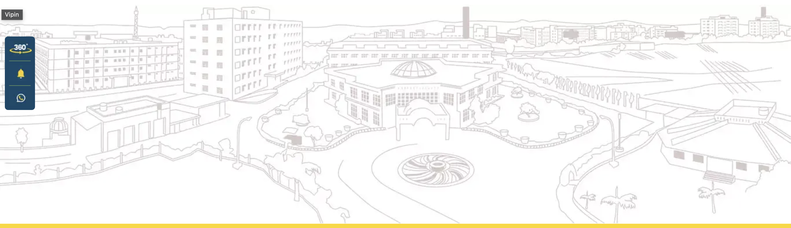
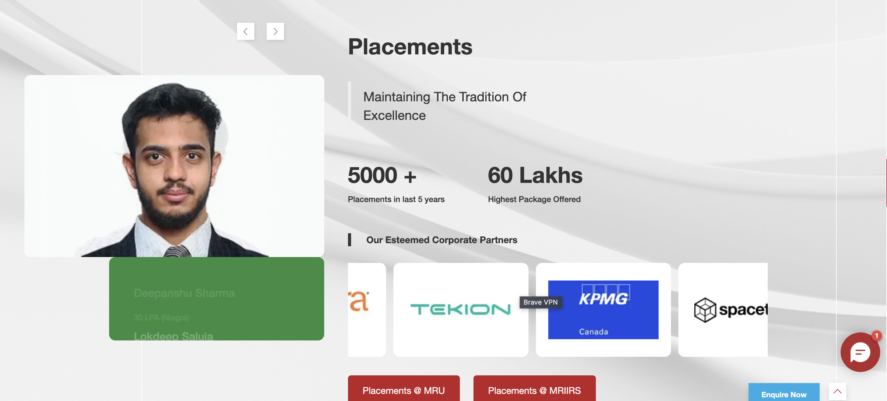
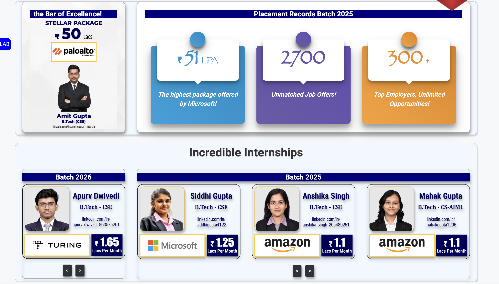
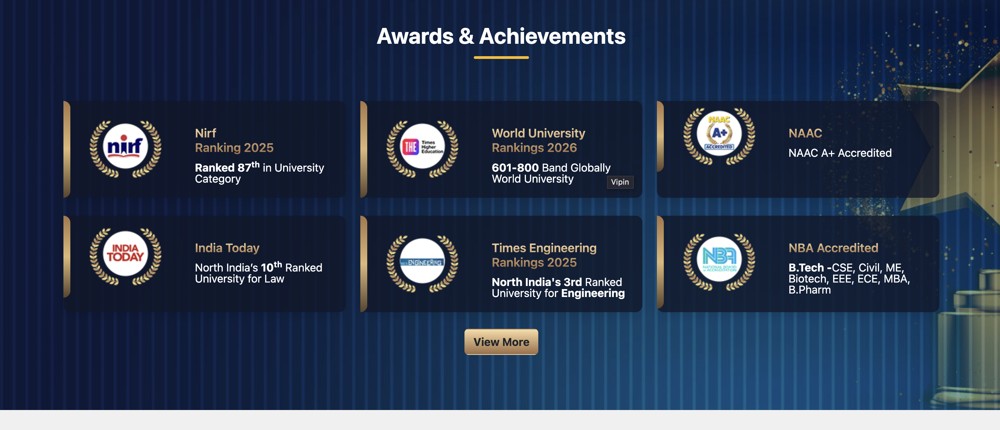
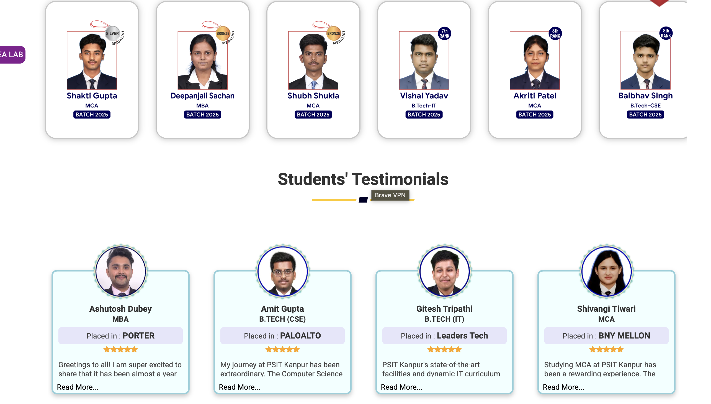
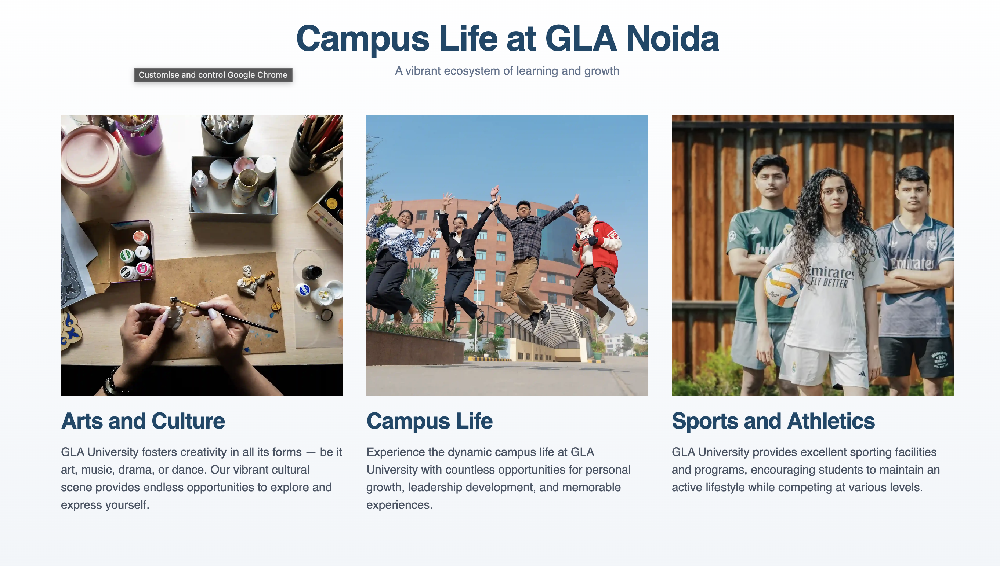
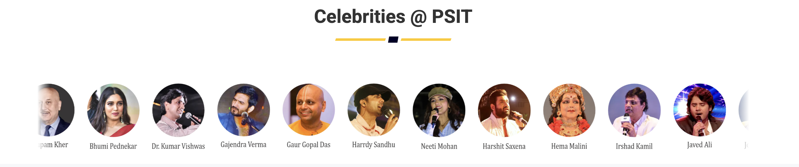
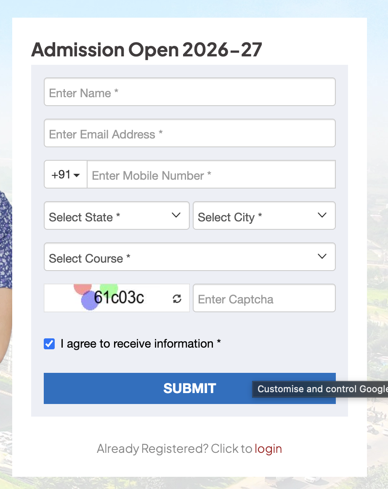

clone= https://eit-portfolio.vercel.app

navbar {
    color:green # here green color means logo green
    bg:blue # here blue color means logo blue
}

herosection{
    as per clone but need to change data
    also need to change the youtube video remove video

}

why eit {

as per clone but need to change the background like a sketch of the infrastructutre like 

    }

courses {

as per clone like slide show make sure the links are working for every course

}

palcements {

as per manav rachna website. https://manavrachna.edu.in/

also take a refernece from psit combine both

}

achivements and recogintaion {

}

students sucess stories {

corusel like  graphic era placements change pic below

}

student work {

as per amity website https://amity.edu/

}

campus life{

same as cloned with photos like gla noida

}

clubs and activities{

same as clone website make sure every link is working for every club there find scroller 

}

events and notifications{

upcoming, archive  type 2 divisions

}

shooting includes in gallery

podcast and talks {

same as this scroller

}
